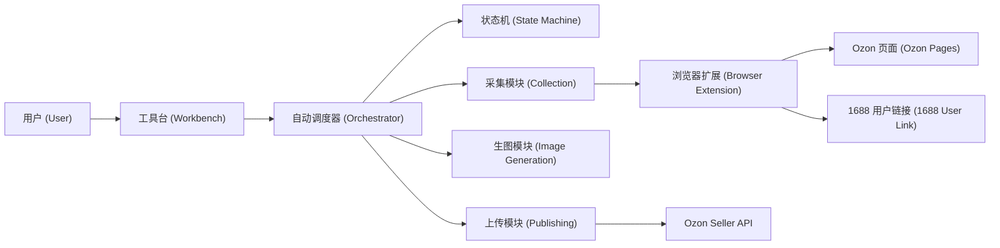

# Ozon V2 模块化自动化工具台设计 (Modular Automation Workbench Design)

日期 (Date): 2026-07-10

状态 (Status): 已确认，等待实施计划 (Approved, Pending Implementation Plan)

## 1. 目标 (Goal)

Ozon V2 只围绕一条生产主线建设：

```text
Ozon 自动采集
  -> 用户提供并确认 1688 真实供应商链接与单一 SKU
  -> 扩展采集真实供应商证据
  -> 自动生成图片
  -> 自动构建并校验 Ozon 草稿
  -> 用户确认后提交上传
```

采集、生图、上传必须是三个独立模块。模块分离只用于控制复杂度，不增加用户点击步骤。用户新建批次后，调度器自动推进，只有真实人工门禁才暂停。

## 2. 本设计废止的旧规则 (Superseded Rules)

以下旧规则不再适用于 Ozon V2 主线：

- 系统自动进入 1688 首页以图搜款并展示候选。
- 系统或模型自动判断哪个 1688 候选是完全同款。
- 1688 采集必须从首页开始，不能接受用户提供的详情页链接。
- 生产采集只能由 Microsoft Playwright MCP 执行。
- 所有运行信息、操作按钮和原始 JSON 堆在同一个工具台页面。

新的唯一规则是：Ozon 与 1688 页面采集由批准的浏览器扩展执行；用户负责提供真实供应商链接并确认单一 SKU；工具台和状态机负责调度与门禁。

## 3. 总体架构 (Architecture)

采用单进程模块化流水线，不引入微服务、消息队列或第二套状态系统。



自动调度器是唯一流程入口。三个业务模块不能直接改变批次状态，只能返回结构化结果，由调度器验证成功后请求状态机转换。

## 4. 模块边界 (Module Boundaries)

### 4.1 采集模块 (Collection)

负责：

- 店铺授权状态与已有商品去重。
- 种子抽取和安全俄语查询词。
- Ozon 类目属性模板和单一目标 SKU 证据。
- Ozon 商品名称、图片和尺寸原始证据。
- 等待用户提交 1688 供应商链接。
- 通过浏览器扩展采集用户确认的 1688 商品、单一 SKU、价格、起批量、真实国内运费、属性和图片。

禁止：

- 自动搜索或推荐 1688 候选。
- 替用户判断是否完全同款。
- 生成图片、构建上传 payload 或调用发布接口。

### 4.2 生图模块 (Image Generation)

输入仅为已确认的 `CollectionResult`。它使用 Ozon 风格参考图和 1688 真实商品图生成新的商品图片，并输出 `ImageGenerationResult`。

禁止：

- 访问 Ozon 或 1688 页面。
- 修改采集证据、价格、SKU 或类目属性。
- 构建或提交商品草稿。

### 4.3 上传模块 (Publishing)

输入仅为 `CollectionResult`、`ImageGenerationResult` 和 Seller API 类目模板。它负责生成标题、描述和富内容，映射客观属性，构建草稿，校验必填字段，并在用户确认后调用 Seller API 提交。

禁止：

- 重新采集网页。
- 重新生成图片。
- 绕过类目模板、去重、单一 SKU 和发布确认门禁。

### 4.4 浏览器扩展 (Browser Extension)

扩展只做页面执行器：

- Ozon 内容脚本读取公共商品页面并回传证据。
- 1688 内容脚本接收用户提供的详情页链接。
- 用户在页面选择匹配的单一 SKU 后执行“确认供应商并采集 (Confirm Supplier And Collect)”。
- 扩展把结构化证据提交给本地工具台，不直接写运行状态。

扩展不绑定或导出 Ozon Cookie，不生成图片，不调用上传接口。

## 5. 数据合同 (Data Contracts)

模块之间只通过三个版本化结果交接：

```text
CollectionResult
  run_id
  work_item_id
  ozon_product_name
  ozon_images
  ozon_dimension_evidence
  ozon_category_template
  ozon_target_sku
  supplier_url
  supplier_confirmation
  supplier_single_sku
  supplier_price_and_moq
  supplier_shipping_evidence
  supplier_attributes
  supplier_images

ImageGenerationResult
  run_id
  work_item_id
  source_fingerprints
  generated_images
  generation_evidence
  validation_status

ListingDraftResult
  run_id
  work_item_id
  category_template_version
  mapped_objective_attributes
  rewritten_content
  generated_images
  validation_errors
  seller_payload
```

后续模块只能读取前序结果，不能回写前序结果。每份结果一旦被下游消费，只能生成新版本，不能静默覆盖。

## 6. 自动状态流 (Automated State Flow)

```text
CREATED
  -> DEDUPING_STORE
  -> SEED_SELECTED
  -> ATTRIBUTE_TEMPLATE_COLLECTING
  -> OZON_COLLECTING
  -> OZON_COLLECTED
  -> WAITING_SUPPLIER_LINK          [用户门禁]
  -> SUPPLIER_COLLECTING
  -> SUPPLIER_COLLECTED
  -> IMAGE_PROCESSING
  -> IMAGE_READY
  -> DRAFT_BUILDING
  -> DRAFT_READY
  -> PUBLISH_WAITING_CONFIRMATION   [用户门禁]
  -> PUBLISH_SUBMITTED
  -> DONE
```

用户提交合法供应商链接并完成单一 SKU 确认后，调度器必须自动恢复，不需要用户点击“下一步”。图片生成成功后也必须自动进入草稿构建。

第一版只有三个允许暂停的人工门禁：

- 首次或更换店铺时的授权绑定。
- 每件商品的 1688 供应商链接与单一 SKU 确认。
- 草稿校验通过后的真实发布确认。

## 7. 供应商人工门禁 (Supplier Manual Gate)

工具台为每件已采集的 Ozon 商品提供一个找货证据区，只展示：

- 产品名称。
- 主图和必要参考图。
- 尺寸证据，包括解析值、原始页面文字或截图、来源链接和采集时间。
- 1688 供应商链接输入框。

用户负责寻找完全相同的商品并提交详情页链接。系统不展示候选列表，也不做同款置信度判断。

链接提交后：

1. 工具台校验域名和商品链接格式。
2. 扩展复用一个 1688 标签页并等待页面稳定，不重复弹出窗口。
3. 用户选择对应的单一 SKU 和运费目的地上下文。
4. 用户点击一次“确认供应商并采集 (Confirm Supplier And Collect)”。
5. 扩展采集并回传供应商证据。
6. 校验通过后，自动调度器继续生图流程。

这一次确认同时代表“用户确认完全同款”和“确认当前单一 SKU”，不再增加第二个同款复核按钮。

## 8. 工具台信息架构 (Workbench Information Architecture)

工具台不再把全部信息堆在单页。使用固定顶部批次控制栏和五个独立视图：

1. 批次总览 (Batch Overview)：批次状态、整体进度、当前阻塞原因、开始和停止。
2. 商品采集 (Collection)：Ozon 证据、供应商链接输入和采集状态。
3. 图片生成 (Image Generation)：原图、生成图、任务状态和失败重试。
4. 商品上传 (Publishing)：字段校验、草稿、发布确认和提交结果。
5. 运行日志 (Run Logs)：固定高度、可筛选、按需加载的事件列表。

设计规则：

- 页面切换不改变自动化状态。
- 顶部始终可见当前批次、总体阶段和停止按钮。
- 原始 JSON 默认折叠，不占主操作区。
- 列表和日志使用固定高度滚动，运行事件不能无限拉长页面。
- 每个页面只显示本阶段需要的数据和动作。

## 9. 自动运行与停止 (Automation And Stop)

- 新建批次后自动调度器立即启动并持续运行到下一个真实门禁。
- 每个批次同一时间只允许一个调度租约，避免后台线程覆盖状态。
- 每个工作项同一时间只允许一个浏览器任务和一个受控标签页。
- 停止操作使当前租约失效并取消浏览器任务；已落盘证据保留。
- 继续执行从最近一个已验证结果恢复，不重复抽种子、不重复采集或重复上传。
- 重试必须幂等；发布提交必须有唯一请求键，避免重复商品。

## 10. 错误隔离 (Error Isolation)

- Ozon 采集失败只影响对应工作项，不触发生图或上传。
- 1688 页面失效时回到 `WAITING_SUPPLIER_LINK`，保留 Ozon 找货证据。
- 生图失败只重试生图模块，不重新采集。
- 草稿校验失败保留采集和图片结果，只返回上传模块修正。
- 发布接口失败保留草稿和请求证据，重试时使用相同幂等键。
- 任一模块不能用“补数据”方式静默修改前序证据。

## 11. 防臃肿约束 (Anti-Bloat Guardrails)

这些约束属于架构门禁，不是建议：

1. 全项目只有一个生产状态机和一个自动调度器。
2. 采集、生图、上传不能互相导入内部实现，只能依赖共享数据合同。
3. 工具台前端不包含业务判断和网页采集代码。
4. 第一版不引入微服务、消息队列、数据库迁移框架或第二套任务系统。
5. 新功能必须明确归属一个模块；无法归属时不进入主线。
6. 一个修复不能顺带重构无关模块。
7. 每次架构变更必须更新本设计的边界或新增明确 ADR，不能只改代码。
8. 自动化步骤必须有结构化输入、结构化结果和独立测试，不能靠 Codex 对话临时推进。

## 12. 测试与验收 (Testing And Acceptance)

### 自动测试 (Automated Tests)

- 状态机测试：只允许合法转换，人工门禁不可绕过。
- 架构边界测试：三个模块不能跨边界导入内部实现。
- 数据合同测试：缺失关键证据时不能进入下一阶段。
- 浏览器扩展测试：Ozon 与 1688 内容脚本互相隔离；同一任务不重复开页。
- 调度器测试：自动运行、停止、恢复、租约失效和幂等重试。
- 端到端测试：使用假采集、假生图和假 Seller API 跑完整批次，不产生真实发布。

### 验收标准 (Acceptance Criteria)

- 用户新建批次后，系统自动运行到供应商链接门禁。
- 每件商品明确展示名称、图片和尺寸原始证据。
- 用户提交 1688 链接并确认单一 SKU 后，系统自动完成供应商采集。
- 供应商采集成功后自动进入生图，再自动进入草稿构建。
- 采集、生图和上传分别位于独立代码模块和独立工具台视图。
- 页面不会因运行事件持续增长而无限拉长。
- 停止后不再创建新浏览器任务；继续后不重复已完成阶段。
- 未经发布确认不得调用真实 Seller API 提交接口。

## 13. 非目标 (Non-Goals)

- 不自动搜索 1688 同款。
- 不自动判断 1688 是否完全同款。
- 不收集完整多 SKU 树，只保留用户确认的单一 SKU。
- 不绑定或导出 Ozon Cookie。
- 不在第一版同时支持多个图片生成供应商。
- 不为了界面整洁引入新的前端框架。
- 不改动旧插件，不共享旧插件运行数据。
