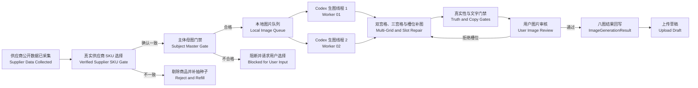

# Ozon V2 产品生图执行器架构设计 (Product Image Generation Executor Design)

## 文档状态 (Document Status)

- 日期 (Date): 2026-07-14
- 状态 (Status): 已确认，实施中 (Approved, In Implementation)
- 适用范围 (Scope): Ozon V2 工作台图片处理阶段
- 旧插件边界 (Legacy Boundary): 不导入、不修改、不复用旧插件业务代码

## 1. 目标 (Goals)

在供应商审核完成后，由 Ozon V2 工作台自动把合格商品交给两个常驻 Codex 生图线程。每件商品使用一张经过用户核实的真实白底主体母图作为不可变真值锚点，先生成一张双宫格主图和两张三宫格副图并裁剪为八个槽位，再仅对失败槽位进行单张补图。八张成品通过真实性和人工验收后回写工作台，作为上传草稿唯一允许使用的图片来源。

最终固定产物为：

- 2 张主图 (Main Images)
- 6 张附图 (Supporting Images)
- 每张图片都有文件哈希、主体母图哈希、提示词版本、槽位角色和验收记录

## 2. 非目标 (Non-Goals)

- 不自动抠图，不把抠图主体硬贴到新背景。
- 不用生成图伪造白底主体母图。
- 不在图片模型中直接生成俄文文字。
- 不在本阶段寻找或核实 1688 供应商。
- 不创建供应商页面不存在的自定义套装或虚构 SKU。采集阶段必须保存全部真实供应商 SKU，生图阶段只处理用户从中确认并锁定的一个真实 SKU。
- 不在本设计中实现视频、动画或多主体组合图。
- 不允许图片阶段修改采集阶段的商品事实。

## 3. 已确认的核心决策 (Approved Decisions)

1. 生图由 Codex 桌面端代执行，不接外部模型 API。
2. 创建两个常驻、可固定的 Codex 生图线程。
3. 两个线程从同一个本地队列领取任务，但一件商品从开始到完成只能归一个线程所有。
4. 每件商品必须先有一张真实、完整、白底、与已锁定供应商 SKU 完全一致的主体母图。
5. 白底主体母图必须来自用户核实后的 1688 供应商证据。
6. 白底主体母图文件和 SHA-256 哈希在整次生图期间不可变化。
7. Ozon 图片只提供风格、构图、布局和商业表现参考。
8. 1688 其他图片只提供结构、材质、配件和细节证据。
9. 首轮生成一张双宫格主图和两张三宫格副图，裁剪得到八张候选图。
10. 合格槽位立即冻结；失败槽位改为单张补图，不重做已合格图片。
11. 每个失败槽位最多补图两次，仍不合格则进入人工处理。
12. 八张最终成品必须回写工作台，上传草稿不得读取临时图或失败图。

### 3.1 真实供应商 SKU 选择门禁 (Verified Supplier SKU Gate)

供应商商品页本身可能包含单只、套装、颜色、型号和数量不同的多个真实 SKU。扩展必须采集页面公开展示的全部真实 SKU 组合，不允许只保存当前默认 SKU，也不允许把规格按钮文本误当成完整组合。

每个真实供应商 SKU 至少保存：

- 供应商 SKU ID 或可稳定复现的 SKU 组合键。
- 原始规格名称，以及颜色、型号、数量、套装组成和配件事实。
- 该 SKU 的公开价格、库存状态和 SKU 绑定图片。
- 证据来源和采集完整性；无法证明为真实组合时必须标记为不完整，不能进入确认门禁。

工作台把 Ozon 目标 SKU 与全部真实供应商 SKU 并排展示，由用户执行以下二选一操作：

- `确认一致 (Confirm Match)`：锁定一个真实供应商 SKU。
- `不一致并替换 (Reject and Replace)`：剔除当前 Ozon 商品，把对应种子加入黑名单，并补抽新种子保持批次数量。

锁定后生成不可变 `SupplierSkuSelectionReceipt`。采购成本、标题事实、属性、主体母图、生图任务和上传草稿都只能读取这张收据；不得在后续阶段静默切换 SKU。若锁定的是四只套装，主体母图与所有图片必须展示同一套四只商品及其真实颜色和配件，单只图片不能作为套装主体母图。

## 4. 总体架构 (Architecture)



### 4.1 工作台 (Workbench)

工作台负责确定性流程，不负责自由发挥：

- 验证供应商审核已经完成。
- 验证全部真实供应商 SKU 证据已经采集，并要求用户锁定一个真实 SKU。
- 保存不可变 SKU 选择收据，后续阶段只读取该收据。
- 验证主体母图存在且符合输入门禁。
- 编译不可变的图片任务合同。
- 把商品任务写入本地队列。
- 展示两个 Codex 线程的在线、空闲、忙碌和离线状态。
- 实时展示每个商品、每个槽位的进度和失败原因。
- 接收最终八图结果并交给用户审核。
- 只有用户确认后才允许上传草稿读取图片。

工作台不得在没有线程接单时显示“正在生成”。两个线程都离线时，图片阶段明确阻断为“等待 Codex 生图线程上线”。

### 4.2 本地图片队列 (Local Image Queue)

使用独立 SQLite 队列保存图片任务、商品所有权、线程租约和槽位状态。队列与现有采集业务数据分离，但通过 `run_id` 和 `product_id` 建立明确关联。

关键规则：

- 原子领取，防止两个线程领取同一商品。
- 商品级租约，不按图片槽位拆给不同线程。
- 线程异常退出后，租约到期才允许同一商品被另一个线程恢复。
- 恢复时读取已有槽位收据，不重新生成已通过图片。
- 空队列时线程处于等待状态，不重复创建任务。

### 4.3 Codex 生图线程 (Codex Image Workers)

安装或首次配置时一次性创建两个固定任务：

- `Ozon 生图线程 01 (Ozon Image Worker 01)`
- `Ozon 生图线程 02 (Ozon Image Worker 02)`

每个线程运行独立的 Ozon 生图 Skill，只负责：领取整件商品、读取证据、调用图片生成、裁剪、槽位补图、超清、俄文排版、验收和回写收据。

两个线程可以同时处理两件不同商品，但不得共同处理同一商品。电脑或 Codex 重启后，如果线程没有恢复，工作台必须显示离线并阻断，不得自动伪造完成状态。

### 4.4 Ozon 生图 Skill (Ozon Product Image Skill)

创建独立 Skill，不直接修改 Yandex 生图 Skill。可复用 Yandex 已验证的控制机制：

- 稳定线程 ID
- 原子任务领取
- 商品所有权
- 租约和防重复提交
- 固定提示词哈希
- 结果收据验证
- 断点恢复

不得复用 Yandex 的七槽位和禁止宫格媒体合同；Ozon 使用本设计定义的一张双宫格、两张三宫格和八槽位合同。

## 5. 主体母图门禁 (Subject Master Gate)

主体母图必须同时满足：

- 来源是用户已核实的 1688 商品链接及其公开图片。
- 白色或接近纯白背景。
- 只出现一个已确认 SKU 主体；这里的“一个主体”指一个销售单元，真实四件套必须完整展示四件，不能拆成单只。
- 主体完整，不能被裁边、遮挡或压缩变形。
- 颜色、结构、部件、数量和配件与已确认 SKU 一致。
- 分辨率足以作为生成参考。
- 文件可以稳定保存到运行数据目录并计算 SHA-256。

如果没有合格图片：

1. 工作台不创建生图任务。
2. 商品状态变为 `等待主体母图 (Waiting for Subject Master)`。
3. 用户只能从已锁定 SKU 的供应商图片中重新选择真实白底图；不能用其他 SKU 图片，也不能用生成图代替。
4. 未通过门禁前不允许调用图片生成。

## 6. 八图槽位合同 (Eight-Slot Contract)

| 槽位 (Slot) | 角色 (Role) | 首轮来源 (Initial Source) | 内容边界 (Content Boundary) |
| --- | --- | --- | --- |
| `main_01` | 主图 1 | 双宫格主图 | 美观、产品主导的商业场景；默认不加俄文 |
| `main_02` | 主图 2 | 双宫格主图 | 与主图 1 明显不同的高质感使用场景；默认不加俄文 |
| `detail_01` | 附图 1 | 三宫格副图 A | 核心功能与结构，带准确俄文卖点 |
| `detail_02` | 附图 2 | 三宫格副图 A | 材质与局部细节，带准确俄文卖点 |
| `detail_03` | 附图 3 | 三宫格副图 A | 真实使用场景一，带准确俄文卖点 |
| `detail_04` | 附图 4 | 三宫格副图 B | 真实使用场景二，带准确俄文卖点 |
| `detail_05` | 附图 5 | 三宫格副图 B | 尺寸、结构或客观参数，带准确俄文标注 |
| `detail_06` | 附图 6 | 三宫格副图 B | 包装、配件或补充卖点，带准确俄文；只能展示有证据的内容 |

如果包装或配件没有可靠证据，`detail_06` 自动改用经过证据支持的第三个细节或场景，不得臆造附件。

## 7. 生成流程 (Generation Flow)

### 7.1 首轮宫格生成 (Initial Grids)

同一线程按顺序生成：

1. 双宫格主图，覆盖 `main_01`、`main_02`，两个画面必须具有不同场景与构图。
2. 三宫格副图 A，覆盖 `detail_01`、`detail_02`、`detail_03`。
3. 三宫格副图 B，覆盖 `detail_04`、`detail_05`、`detail_06`。

三次生成必须引用完全相同的主体母图文件和哈希。双宫格输出先保存原图和收据，再由本地确定性裁剪程序按固定 1x2 边界裁为两张主图；每张三宫格按固定 1x3 边界裁为三张副图。主图默认不添加俄文，副图裁剪后统一进入本地俄文排版。

### 7.2 槽位级验收 (Slot Validation)

每张裁剪图独立验收：

- 合格：保存为不可变槽位候选，状态变为 `已通过 (Passed)`。
- 不合格：记录具体原因，状态变为 `需要补图 (Repair Required)`。

任一槽位失败不会删除或覆盖其他合格槽位。

### 7.3 单张补图 (Single-Image Repair)

补图只针对失败槽位：

- 使用同一主体母图。
- 使用该槽位的固定模板。
- 保留原始失败原因作为负向约束。
- 每个槽位最多补图两次。
- 两次仍失败，状态变为 `待人工处理 (Manual Review Required)`。
- 当前商品暂停，其他商品和另一个线程继续执行。

### 7.4 超清和俄文排版 (Upscale and Russian Copy)

处理顺序固定为：

`生成或补图 → 真实性预检 → 保守超清 → 本地俄文排版 → 最终验收`

超清必须是保守增强，不允许生成式重绘产品。俄文由本地排版程序添加，图片模型只生成预留文字区域，不直接绘制文字。

## 8. 固定提示词合同 (Fixed Prompt Contract)

提示词由四层组成，并记录版本和最终哈希。

### 8.1 主体真值层 (Subject Truth Layer)

- 固定主体母图文件和 SHA-256。
- 固定 SKU、颜色、数量、结构、配件和比例。
- 明确产品只能出现一个主体。
- 明确禁止增加、删除、替换或变形任何部件。

### 8.2 槽位模板层 (Slot Template Layer)

每个槽位有独立固定模板，只允许改变：

- 场景
- 相机角度
- 光线
- 构图
- 背景和俄文留白位置

模板不得改变产品事实。

### 8.3 参考边界层 (Reference Boundary Layer)

- Ozon 参考图：只学习风格、布局、构图和美观性。
- 1688 细节图：只核实真实结构、材质、配件和包装。
- 主体母图：唯一允许控制产品外形的图像锚点。

### 8.4 禁止项层 (Negative Constraints)

- 禁止多主体、重复主体和主体拼贴。
- 禁止错误颜色、错误尺寸比例和错误部件数量。
- 禁止增加不存在的配件、包装、标志和功能。
- 禁止模型生成俄文、品牌、水印和商标。
- 禁止裁断、遮挡或隐藏关键结构。

## 9. 俄文卖点合同 (Russian Copy Contract)

俄文内容必须从已核实事实编译，不允许从同行图片复制，也不允许编造营销承诺。

- 两张主图默认不添加俄文，保持画面干净并突出产品与场景。
- 六张附图必须添加俄文标注，每张最多一条标题和两条短卖点。
- 尺寸数字必须来自已核实属性。
- 文案长度、字号和安全区由固定排版模板约束。
- 文案溢出、乱码、与背景低对比时自动拒绝该排版结果，不重新生成产品图。
- 俄文排版失败只重做文字层，不消耗图片生成次数。

## 10. 真实性门禁 (Truth Gates)

### 10.1 自动门禁 (Automated Gates)

自动检查至少包括：

- 主体母图哈希一致。
- 只有一个主要产品主体。
- 主体未被明显裁断或遮挡。
- 图片尺寸、格式和槽位角色正确。
- 没有生成文字、水印或额外品牌。
- 尺寸、数量和卖点文字来自已核实字段。
- 输出文件哈希唯一且文件可读取。

Codex 生图线程还需执行视觉真实性检查，逐项比较主体外形、颜色、结构、数量、部件和配件。自动检查不能替代最终用户确认。

### 10.2 用户门禁 (User Review Gate)

工作台把主体母图、Ozon 风格参考和八张最终图片并排显示。用户可以：

- 确认全部图片。
- 拒绝单个槽位并填写原因。
- 对仍在两次补图额度内的槽位重新派发。
- 对达到上限的槽位更换主体母图或人工处理。

只有全部八个槽位通过用户确认，商品才进入 `图片已完成 (Images Approved)`。

## 11. 数据合同 (Data Contracts)

### 11.1 真实供应商 SKU (SupplierSkuOption)

```json
{
  "supplier_sku_id": "sku-...",
  "combination_key": "颜色:粉色|数量:4支",
  "raw_label": "粉色 4支套装",
  "selected_options": {"颜色": "粉色", "数量": "4支"},
  "set_quantity": 4,
  "set_composition": ["粉色修正笔 x4"],
  "price": {"currency": "CNY", "amount": "12.80"},
  "stock": {"status": "in_stock", "quantity": 368},
  "image_urls": ["https://..."],
  "evidence_source": "1688_public_sku_map",
  "complete": true
}
```

### 11.2 SKU 选择收据 (SupplierSkuSelectionReceipt)

```json
{
  "run_id": "wb-...",
  "product_id": "...",
  "supplier_offer_id": "...",
  "supplier_sku_id": "sku-...",
  "supplier_sku": {},
  "ozon_target_sku": {},
  "differences": [],
  "decision": "confirmed_match",
  "selection_sha256": "...",
  "confirmed_by": "user",
  "confirmed_at": "..."
}
```

相同商品只能存在一张当前有效收据。已锁定收据不可原地改写；用户要更换 SKU 时必须废弃旧收据、清除未审批图片任务，并重新确认主体母图。

### 11.3 主体母图 (SubjectMaster)

```json
{
  "run_id": "wb-...",
  "product_id": "...",
  "sku_id": "...",
  "supplier_sku_selection_sha256": "...",
  "source": "verified_1688",
  "path": "...",
  "sha256": "...",
  "width": 1600,
  "height": 1600,
  "verified_facts_hash": "...",
  "approved_at": "..."
}
```

### 11.4 图片任务 (ImageGenerationJob)

```json
{
  "job_id": "imgjob-...",
  "run_id": "wb-...",
  "product_id": "...",
  "supplier_sku_selection_sha256": "...",
  "subject_master": {},
  "verified_facts_path": "...",
  "ozon_style_references": [],
  "supplier_detail_references": [],
  "prompt_contract_version": "ozon-image-v1",
  "slot_ids": [
    "main_01",
    "main_02",
    "detail_01",
    "detail_02",
    "detail_03",
    "detail_04",
    "detail_05",
    "detail_06"
  ]
}
```

任务合同创建后不可原地改写。主体母图或已核实事实发生变化时，废弃旧任务并创建新版本。

### 11.5 槽位收据 (ImageSlotReceipt)

```json
{
  "slot_id": "detail_03",
  "role": "usage_scene_01",
  "status": "passed",
  "source_kind": "detail_grid_a",
  "repair_attempts": 0,
  "image_path": "...",
  "image_sha256": "...",
  "subject_master_sha256": "...",
  "prompt_sha256": "...",
  "truth_gate": "passed",
  "copy_gate": "passed",
  "worker_id": "ozon-image-worker-01"
}
```

### 11.6 最终结果 (ImageGenerationResult)

最终结果包含八个已通过槽位、用户确认时间、版本信息和完整收据。任何槽位不是 `passed` 时，结果不得标记完成。

## 12. 状态与恢复 (State and Recovery)

图片阶段内部状态使用独立细粒度状态，不让主状态机无限膨胀：

- `waiting_for_subject_master`
- `waiting_for_supplier_sku_selection`
- `supplier_sku_locked`
- `queued`
- `claimed`
- `generating_main_grid`
- `generating_detail_grid_a`
- `generating_detail_grid_b`
- `validating_slots`
- `repairing_slot`
- `manual_review_required`
- `waiting_for_user_approval`
- `approved`
- `cancel_requested`
- `stopped`

恢复规则：

- 已通过槽位永不重复生成。
- 任一双宫格或三宫格已经生成但尚未裁剪时，从保存的宫格原图继续裁剪。
- 裁剪完成但尚未超清时，从槽位收据继续。
- 用户停止后，线程完成当前不可中断的图片工具调用，随后停止，不再领取新商品。
- 用户继续后，从最后一个未完成槽位恢复。
- 不允许停止后自动弹出页面或重复创建图片任务。

## 13. 工作台界面 (Workbench UI)

图片处理页面必须显示：

1. 两个 Codex 生图线程的在线、空闲、忙碌、离线和最后心跳。
2. 当前队列商品数和已完成商品数。
3. 每件商品的主体母图、主体哈希和已核实 SKU。
4. 一张双宫格和两张三宫格原始结果，可折叠查看。
5. 八个固定槽位及其状态、补图次数和失败原因。
6. 主体母图与最终图片并排审核视图。
7. 单槽位拒绝、重新补图和最终确认操作。
8. 固定高度、分页或商品切换，不允许商品数量把页面无限拉长。

供应商审核页面必须在进入图片阶段前显示全部真实供应商 SKU，并逐个展示原始规格名、组合、套装数量、价格、库存和 SKU 图片。未生成有效 SKU 选择收据时，图片阶段保持锁定。

最终确认后，工作台把八图结果写入上传草稿，并在上传页面只读展示，不允许上传阶段偷偷替换图片。

## 14. 错误处理 (Error Handling)

| 错误 (Error) | 处理 (Handling) |
| --- | --- |
| 供应商 SKU 组合不完整 | 阻断确认；不得把规格按钮文本当作真实 SKU |
| 用户判定没有一致 SKU | 剔除商品、种子进黑名单并补抽新种子 |
| 已锁定 SKU 被更换 | 废弃旧收据和未审批图片任务，重新选择主体母图 |
| 套装主体母图缺件 | 阻断生图；要求选择完整套装白底图或拒绝商品 |
| 缺少白底主体母图 | 阻断该商品并请求用户选择或上传 |
| 主体母图哈希变化 | 废弃当前图片任务，要求重新确认主体 |
| 两个线程离线 | 阻断图片阶段，显示恢复线程提示 |
| 双宫格或三宫格生成失败 | 仅重试当前宫格；不影响另一个商品 |
| 单槽位失真 | 保留其他槽位，单张补图 |
| 单槽位两次补图失败 | 进入人工处理，不再自动重试 |
| 俄文排版失败 | 只重做文字层 |
| 回写收据校验失败 | 不进入上传草稿，保留本地文件供诊断 |
| 用户停止任务 | 设置取消标记，当前工具调用结束后停止 |

所有错误写入当前批次诊断 ZIP，包括任务合同、线程状态、提示词版本、收据、失败原因和文件哈希；不包含店铺 API 密钥。

## 15. 测试策略 (Testing Strategy)

### 15.1 单元测试 (Unit Tests)

- 全部真实供应商 SKU 组合解析与不完整证据阻断。
- SKU 选择收据哈希、不可变约束与更换 SKU 失效规则。
- 套装数量与主体母图数量一致性。
- 主体母图门禁和哈希锁定。
- 八槽位角色及完整性校验。
- 双宫格 1x2 和三宫格 1x3 固定裁剪边界。
- 合格槽位冻结和单槽位补图。
- 每槽位最多两次补图。
- 俄文排版溢出与事实来源校验。
- 最终结果缺少任意槽位时拒绝完成。

### 15.2 并发与恢复测试 (Concurrency and Recovery Tests)

- 两个线程不能领取同一商品。
- 一个线程异常退出后租约恢复。
- 已通过槽位在恢复后不重复生成。
- 停止后不再领取任务，继续后从断点恢复。
- 线程离线时工作台不显示虚假进度。

### 15.3 集成测试 (Integration Tests)

- 模拟一个包含单只和四只套装的 1688 商品，确认只有用户锁定的真实 SKU 能进入生图。
- 模拟无一致 SKU，确认商品剔除、种子进黑名单并补足队列。
- 使用模拟生图器验证完整八图流程。
- 模拟一张三宫格含一个合格、两个失败槽位，确认只补两个失败槽位。
- 模拟补图两次失败，确认转人工且其他商品继续。
- 确认上传草稿只接受已通过的 `ImageGenerationResult`。

### 15.4 实战验收 (Real-World Verification)

先使用一件已核实供应商、具备合格白底主体图的真实商品：

1. 生成一张双宫格和两张三宫格。
2. 裁剪八张并执行槽位验收。
3. 人为拒绝一个槽位，验证单张补图。
4. 完成超清和俄文排版。
5. 在工作台确认八图回写。
6. 在上传草稿确认图片顺序和哈希一致。

## 16. 验收标准 (Acceptance Criteria)

- 1688 采集结果展示全部可证明的真实 SKU，而不是只展示默认规格或按钮标签。
- 用户未确认一个真实供应商 SKU 时，生图任务不会创建。
- 锁定四件套时，主体母图与八张成品都保持真实四件套数量、颜色和配件。
- 采购、标题、属性、生图和上传读取同一张 SKU 选择收据。
- 点击工作台图片阶段后，在线 Codex 线程真实领取任务并产生可见进度。
- 两个线程可以同时处理两件商品，但同一商品不被拆分。
- 没有合格主体母图时不调用生图。
- 首轮得到一张双宫格和两张三宫格，并正确裁为八个槽位。
- 合格槽位不会因其他槽位失败而重做。
- 失败槽位最多单张补图两次。
- 所有最终图片使用同一主体母图哈希。
- 产品形状、颜色、结构、数量和配件不发生无证据变化。
- 俄文文字清晰、无乱码且只陈述已核实事实。
- 八张图片在工具台可见、可审、可拒绝、可恢复。
- 上传草稿只读取用户确认后的八图结果。
- 停止、刷新和重启不会造成重复生图或强制弹窗。

## 17. 实施边界 (Implementation Boundary)

本设计批准后，实施应拆成独立小步：数据合同和队列、线程协议、Ozon 生图 Skill、双宫格与三宫格裁剪、槽位补图、俄文排版、工作台回写与审核界面、上传草稿门禁。每一步都先写失败测试，再做最小实现和回归验证。

当前工作区不是 Git 仓库，因此本设计文档只能落盘和同步 Obsidian，不能在未获得用户明确授权时初始化仓库或创建提交。
