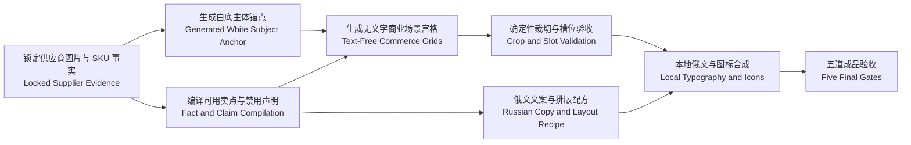

# Ozon V2 八图商业视觉系统设计（Eight-Image Commerce Visual System Design）

## 文档状态（Document Status）

- 日期（Date）：2026-07-19
- 状态（Status）：用户已确认视觉方向，待用户审核书面规范（Approved Direction, Pending Written Spec Review）
- 范围（Scope）：Ozon V2 生图提示词、八图槽位职责、本地俄文排版与视觉验收
- 旧插件边界（Legacy Boundary）：不读取、不修改旧插件
- 上位设计（Parent Design）：`2026-07-14-ozon-product-image-generation-executor-design.md`

本文只替换上位设计中“八图应如何表现、俄文如何排版、成品如何验收”的视觉合同。队列、租约、断点恢复、动态 Codex 子智能体池、人工审核和上传门禁保持原边界。

## 1. 目标（Goals）

把当前“白底主体锚点 + 2 张主图 + 6 张附图”改造成成熟、统一、真实、适合 Ozon 移动端浏览的商业图片组：

1. 白底主体只负责锁定商品身份和几何结构，不得成为销售图或把白底风格传播给成品。
2. 八张成品由干净商品识别图、结构化俄文信息图和真实生活场景图交替组成。
3. 每张图片只解决一个明确购买问题，八张图片形成完整而不重复的购买叙事。
4. 学习成熟品牌商品卡的网格、信息栏、参数层级、统一色板和系列感，但不复制品牌、颜色或受保护设计。
5. 俄文由本地确定性排版完成，图片模型不直接绘制俄文。
6. 所有卖点、数字、材质、数量、结构、安装方式和包装内容都必须可追溯到锁定的供应证据。
7. 在不增加首轮强制生图调用次数的前提下提高视觉质量。

## 2. 非目标（Non-Goals）

- 不把八张图片做成八张相同的参数海报。
- 不为追求“高级感”虚构材质、承重、尺寸、免打孔、胶粘安装、耐用年限或包装数量。
- 不让俄文标题代替画面证据；图片本身必须先证明该槽位的商业角色。
- 不在图片模型中直接生成文字、徽标、水印、价格、折扣、联系方式或行动号召。
- 不新增外部模型 API，不改变真实上传和店铺授权流程。
- 不改变动态零至五个 Codex 生图子智能体及一个备用位置的调度边界。

## 3. 核心视觉原则（Core Visual Principles）

### 3.1 商品第一（Product First）

商品是第一视觉中心。环境、道具、色块、图标和文字只能解释商品，不能遮挡关键结构或与商品争抢注意力。商品必须完整、自然融入场景，禁止抠图边、拼贴边框、重复主体和无关同类商品。

### 3.2 一图一问（One Buyer Question per Image）

每个槽位在生成前必须写明一个购买问题，例如：

- 这是什么，放在真实空间里是什么效果？
- 最重要的两个价值是什么？
- 在哪里使用？
- 充电线如何通过？
- 哪个结构负责支撑？
- 在办公、小空间或床头场景中有什么价值？

一张图片不能同时承担用途、材质、尺寸、包装、安装和多个场景。

### 3.3 统一系统，不同构图（Consistent System, Varied Composition）

整套图片固定：

- 一套字体家族；
- 一套从商品和场景提取的主色、深色和强调色；
- 一种线性图标笔画；
- 一套圆角、阴影、边距和信息层级；
- 一套 Ozon 安全区域规则。

每个槽位变化：

- 场景；
- 光线；
- 相机角度；
- 景别；
- 当前要回答的购买问题；
- 与槽位职责匹配的排版配方。

### 3.4 信息与画面一体化（Integrated Information Design）

俄文不采用随意漂浮贴纸，也不强制每张图使用大标题。允许的本地排版配方为：

1. `clean_hero`：无文字干净英雄图。
2. `integrated_rail`：沿画面深色或留白区域建立一体化信息栏。
3. `context_caption`：在生活场景底部或侧边放置小型场景说明条。
4. `feature_callout`：用一至两个短标注精确指向可见结构。
5. `metric_panel`：只有存在已验证数字时，才突出尺寸、数量或参数。

布局配方由槽位角色和证据类型选择，不由图片模型自由决定。

## 4. 证据流（Evidence Flow）

白底主体锚点只传递身份和几何结构。最终事实仍以锁定供应证据为最高权威。Ozon 或其他优秀商品卡只能提供构图、信息层级和视觉品质参考。

## 5. 八图槽位合同（Eight-Slot Storyboard Contract）

| 槽位（Slot） | 购买问题（Buyer Question） | 视觉职责（Visual Role） | 默认排版配方（Layout Recipe） | 文字密度 |
| --- | --- | --- | --- | --- |
| `main_01` | 商品是什么，放在真实空间里是否好看？ | 最漂亮、最完整、最容易识别的真实场景英雄图 | `clean_hero` | 无文字 |
| `main_02` | 最重要的两个价值是什么？ | 与 `main_01` 明显不同的场景和结构化价值总览 | `integrated_rail` | 最多两个事实 |
| `detail_01` | 商品在哪里、怎样使用？ | 首要使用位置或过程；场景本身必须证明用途 | `context_caption` | 一个短信息块 |
| `detail_02` | 核心功能或结构如何工作？ | 局部特写，回答一个具体结构问题 | `feature_callout` | 一至两个短标注 |
| `detail_03` | 第二个结构、材质或细节价值是什么？ | 与 `detail_02` 不同的角度和景别 | `feature_callout` 或 `metric_panel` | 一至两个事实 |
| `detail_04` | 在另一种真实环境中有什么价值？ | 第二生活场景；环境、光线和用途明显变化 | `context_caption` | 一个短信息块 |
| `detail_05` | 比例、兼容、尺寸或小空间价值是什么？ | 有可靠数字时展示参数；否则展示另一条有证据的场景或结构事实 | `metric_panel` 或 `context_caption` | 一个核心事实 |
| `detail_06` | 还有哪个购买疑问需要关闭？ | 包装、配件、安装、结构总结或第三场景；只使用存在证据的内容 | `integrated_rail` | 最多两个事实 |

### 5.1 当前手机壁挂架示例（Current Phone Holder Example）

当前证据可支持：

- 墙面手机支架；
- 一台手机；
- 安装在插座旁的使用场景；
- 底部中央开口可让充电线通过；
- 两侧前部支撑；
- 屏幕保持可见，手机可以取放。

当前证据不支持：

- 具体材质；
- 胶粘、免打孔或其他安装方式；
- 承重；
- 适配尺寸范围；
- 防水或耐用年限；
- 包装数量和附带配件。

因此 `detail_05` 和 `detail_06` 不得为了填满版面虚构数字或包装，可改用办公、小空间和结构收束场景。

## 6. 俄文文案与排版合同（Russian Copy and Typography Contract）

### 6.1 文案结构

每个信息块最多三级：

1. 关键事实：二至五个俄文词，允许使用大写提高快速识别。
2. 事实说明：一句短语，解释该结构或场景为什么有用。
3. 数字或单位：只在证据明确时出现，并作为视觉重点而非装饰。

默认每张图片只允许一至两个主要信息块。长段落、重复同义词、空洞形容词和多重感叹号一律拒绝。

### 6.2 当前产品可用示例

- `НАСТЕННЫЙ ДЕРЖАТЕЛЬ` / `для смартфона`
- `ОТКРЫТЫЙ НИЗ` / `кабель проходит свободно`
- `БОКОВЫЕ ОПОРЫ` / `поддержка с двух сторон`
- `РЯДОМ С РОЗЕТКОЙ` / `удобно во время зарядки`
- `ТЕЛЕФОН ПОД РУКОЙ` / `экран остаётся открытым`

### 6.3 本地排版要求

- 图片模型只生成无文字场景和可用留白，不绘制俄文。
- 俄文、图标、色块和信息栏在裁切、真实性预检与保守超清后本地合成。
- 字体必须支持完整西里尔字符集；禁止乱码、拉伸、挤压和自动连字符破坏语义。
- 断行必须以词组语义为单位，数字与单位保持成组。
- 对比度、字重、行距和留白必须在移动端缩略图与详情图两个尺度复核。
- 文字层失败只重新排版文字层，不重新生成商品图。

## 7. 场景差异合同（Scene Diversity Contract）

两个成品槽位不能只靠更换背景色或相机角度判定为不同。每对相邻场景至少在下列五项中实质改变三项：

1. 环境类型；
2. 光线和时间感；
3. 相机方向和透视；
4. 景别；
5. 商业用途或购买问题。

对当前手机壁挂架，可使用暖色床头、冷色工作区和紧凑窄墙等经过供应证据支持的常规使用环境，但不得把场景当成安装方式、材质或性能证据。

## 8. 速度合同（Performance Contract）

### 8.1 首轮强制生成次数不增加

每件商品首轮仍固定为四次图片模型调用：

1. 一次白底主体锚点；
2. 一次 `1×2` 主图宫格；
3. 两次 `1×3` 附图宫格。

结构化信息栏、场景说明条、俄文、图标、色板和安全区处理全部在本地完成，不允许为了排版增加图片模型调用。

### 8.2 修复不扩大

- 合格槽位立即冻结，不因其他槽位失败而重做。
- 文字溢出、低对比、断行或图标问题只修文字层。
- 只有主体、场景、结构或真实性失败时，才对失败槽位执行单图修复。
- 单槽修复上限沿用现有合同，不增加默认重试次数。

### 8.3 并发边界不改变

批量任务仍由动态零至五个 Codex 生图子智能体按队列需要领取整件商品；不强行凑满五个，也不创建第六个常规生图子智能体。第六个位置继续保留给诊断、失败恢复或人工介入。

因此正常商品的图片模型等待时间与当前首轮流程基本相同。本地排版会增加少量 CPU 处理时间，但不增加网络或图片模型排队时间。质量门禁导致的单槽修复只发生在不合格图片上，是受限异常路径，不是正常路径。

## 9. 五道成品验收（Five Final Gates）

### 9.1 主体一致性门（Subject Fidelity Gate）

- 颜色、轮廓、比例、结构、数量、开口、部件和配件与锁定证据及白底锚点一致。
- 商品完整可见，无明显裁断、遮挡、变形、重复或拼贴边。

### 9.2 视觉销售力门（Commercial Visual Gate）

- 商品是第一视觉中心。
- 场景光线真实，商品自然融合，没有空白样机感。
- 缩小到商品列表尺寸仍能快速识别商品。

### 9.3 信息有效性门（Information Gate）

- 当前图片只回答一个购买问题。
- 文案与画面证据一致。
- 与已接受槽位不存在同场景、同用途、同文案的实质重复。

### 9.4 俄文成品门（Russian Production Gate）

- 无乱码、拼写错误、语法错误和不自然断行。
- 字体、字重、行距、色彩、图标和对齐属于统一视觉系统。
- 不出现价格、折扣、联系方式、外部品牌和无证据广告承诺。

### 9.5 整套节奏门（Set Rhythm Gate）

- 干净识别图、结构化信息图和生活场景图交替出现。
- 八张统一但不雷同，信息密度有高低节奏。
- `main_01` 保持无文字；其他槽位不因文字遮挡商品或关键场景。

## 10. 错误处理（Error Handling）

| 问题（Problem） | 处理（Handling） |
| --- | --- |
| 商品主体或数量错误 | 拒绝槽位，保留失败原因，执行受限单槽修复 |
| 场景与已接受图片实质重复 | 拒绝槽位，以环境、光线、景别和用途差异作为修复约束 |
| 场景漂亮但没有证明槽位角色 | 拒绝槽位；俄文不能替代视觉证据 |
| 缺少尺寸、材质或包装证据 | 改用其他已验证事实，不生成占位数字或虚构声明 |
| 俄文溢出、乱码或低对比 | 只重新编译本地文字层，不调用图片模型 |
| Ozon 安全区冲突 | 更换本地布局配方或调整文字层位置 |
| 八图全部真实但视觉节奏重复 | 阻止进入人工审核，指出重复槽位并仅修复相关槽位 |

## 11. 测试策略（Testing Strategy）

自动化测试不得触发真实生图，应使用固定夹具和模拟生成器验证：

1. 首轮合同只包含一次白底锚点、一次 `1×2` 和两次 `1×3`，视觉升级不增加强制调用。
2. `main_01` 不生成俄文文字层。
3. `main_02` 和 `detail_06` 可选择 `integrated_rail`，但最多使用两个已验证事实。
4. 没有数字证据时不能选择含数字的 `metric_panel`。
5. 文案事实必须存在于锁定事实清单并携带来源。
6. 文字排版失败不会增加图片生成尝试次数。
7. 场景差异合同能拒绝只换角度或背景颜色的重复图片。
8. 八个槽位全部通过五道门后才能进入人工审核。
9. 合格槽位冻结，单槽失败不会重做其他七张图片。
10. 动态五个常规子智能体和一个备用位置的队列合同不被视觉层修改。

## 12. 验收标准（Acceptance Criteria）

- 白底主体锚点不出现在八张成品中，成品也不会继承纯白产品目录风格。
- 每件正常商品首轮图片模型调用保持四次。
- `main_01` 是无文字、商品主导、真实场景的英雄图。
- `main_02` 使用一体化信息设计，展示最多两个最重要的真实事实。
- 六张附图分别承担不同购买问题，至少包含结构特写和多个实质不同的真实场景。
- 俄文信息像画面的一部分，不是统一大标题或随意漂浮贴纸。
- 数字、材质、尺寸、数量、安装方式和包装内容全部可追溯。
- 俄文排版失败只修文字层，不消耗新的生图次数。
- 八张图片通过主体一致性、视觉销售力、信息有效性、俄文成品感和整套节奏五道验收。
- 自动化测试和回归验证不调用真实图片生成。

## 13. 实施边界（Implementation Boundary）

实施只允许触及 Ozon V2 的提示词资产、槽位视觉角色、事实到俄文文案的编译、本地排版配方、相关验收器和测试。不得顺便重构队列、工作台启动器、浏览器扩展、店铺连接或旧插件。

正式实施前，先由用户审核本书面规范；审核通过后再编写测试驱动实施计划。
