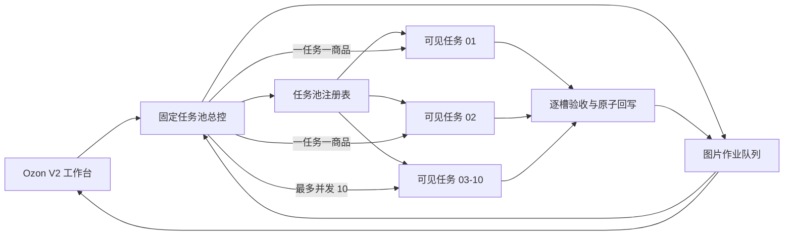

# Ozon V2 固定可见生图任务池设计

## 文档状态

- 日期：2026-07-24
- 状态：已获用户口头确认，等待书面规范复核
- 范围：Ozon V2 图片生成调度、任务复用、结果回写和并发测试
- 替代对象：现有“最多 5 个内部 `spawn_agent` 子 Agent”的生图总控

## 1. 目标

把 Ozon V2 生图执行架构改为固定的 10 个用户可见 Codex 工作任务：

- 左侧任务列表最多且始终只保留 10 个长期生图工作任务。
- 10 个任务可以同时处理 10 件不同商品；总控任务不计入这 10 个并发名额。
- 新商品不得创建第 11 个任务，而是按空闲顺序交给已有任务。
- 同一商品的继续生图、定点返修和补图优先回到首次处理它的工作任务。
- 只有用户明确要求“重新开新的任务”时，才允许替换某个固定任务；替换后总数仍为 10。
- 每个已验收图片槽位立即、幂等地写回队列与工作台，避免磁盘已有图片但工作台只显示两张。
- 单件商品的证据冲突、停止、失败或人工审核不得阻塞其他商品。

## 2. 非目标与业务边界

- 不使用内部 `spawn_agent` 执行生图。
- 不为每件商品创建新的可见任务。
- 不因批次增加而扩大任务池。
- 不自动上传 Ozon，不自动发布，不执行最终审批。
- 不绕过真实 SKU、主体、数量、颜色、比例、图片质量或人工审核门禁。
- 不自动恢复 `stopped` 商品；必须由用户修复证据或明确继续。
- 不重新生成已经通过加密校验并被接受的槽位。
- 本设计不改变八图角色、3:4 成品比例、俄文排版和现有图片真实性规范。

## 3. 核心决策

### 3.1 固定 10 个长期工作任务

系统只维护以下 10 个可见任务槽位：

- `Ozon 生图工作任务 01`
- `Ozon 生图工作任务 02`
- `Ozon 生图工作任务 03`
- `Ozon 生图工作任务 04`
- `Ozon 生图工作任务 05`
- `Ozon 生图工作任务 06`
- `Ozon 生图工作任务 07`
- `Ozon 生图工作任务 08`
- `Ozon 生图工作任务 09`
- `Ozon 生图工作任务 10`

槽位号是稳定身份。每个槽位保存一个不透明的 Codex `thread_id`。系统不得根据名称、顺序或 URL 推导任务 ID。

首次启用固定任务池时，只创建缺少的槽位，直到达到 10 个。达到 10 个后，新批次和新商品只能复用这些任务。任务被用户关闭、归档、删除或变得不可访问时，该槽位标记为 `unavailable`，系统不得擅自创建替代任务；用户明确执行“重新开新的任务”后，才创建替代任务并覆盖该槽位原有 `thread_id`。

### 3.2 工作任务循环复用

工作任务不是商品专属任务。一个任务完成商品 A 后，可以继续处理商品 B、商品 C。每次派发必须携带完整且不可混淆的：

- `run_id`
- `job_id`
- `seed_id`
- Ozon 商品 ID
- 锁定 1688 SKU 收据
- 主体证据收据
- 当前需要处理的槽位
- 指令 ID

任务一次只处理一件商品。完成、停止、失败或转人工审核后，工作任务释放为可再次派发状态。

### 3.3 同一商品的任务亲和

系统持久化 `product_affinity`：

```json
{
  "run_id": "wb-...",
  "job_id": "img-...",
  "seed_id": "seed-...",
  "preferred_slot": "ozon-visible-image-task-03",
  "last_instruction_id": "cmd-..."
}
```

同一商品后续发生以下操作时，优先派发到 `preferred_slot`：

- 继续未完成槽位
- 用户选中图片返修
- 单槽补图
- 断点恢复
- 重新执行验收

若首选任务正忙，该操作在该任务的亲和队列中等待，不为此创建新任务，也不改派到其他任务。这样可以保留该商品完整的生图上下文和可见历史。

只有用户明确要求“重新开新的任务”时，系统才允许替换该固定槽位对应的可见任务。替换是槽位级操作，不增加任务总数；替换后所有仍指向旧槽位的商品亲和关系继续指向同一槽位号，由新任务承接。

### 3.4 全局并发上限

全局最多同时运行 10 个商品生图操作，范围覆盖所有 Ozon V2 批次：

```text
active_visible_image_tasks <= 10
```

总控任务、工作台服务、队列轮询和用户人工审核不计入并发数。空闲可见任务不计入活跃并发，但仍保留在左侧列表。

如果同时存在超过 10 件可执行商品：

1. 最多 10 个空闲任务各领取一件。
2. 其他商品保持 `queued`。
3. 任一任务释放后，总控按队列顺序派发下一件商品。
4. 有亲和返修等待时，该返修只等待自己的首选任务，不挤占其他任务当前商品。

## 4. 架构



### 4.1 固定任务池注册表

注册表是本地持久化事实源，至少记录：

- 固定槽位号
- Codex `thread_id`
- 任务显示名称
- `idle`、`dispatching`、`running`、`waiting_review`、`unavailable`
- 当前 `run_id`、`job_id`、`seed_id`
- 当前指令 ID
- 最后活动时间
- 最近一次成功派发与完成时间

服务重启后先读取注册表，再核对 Codex 任务状态。不得因为工作台刷新或总控重启重新创建任务。

### 4.2 固定任务池总控

总控只负责调度，不生成图片：

1. 读取所有批次的可执行图片作业。
2. 读取 10 个固定任务的真实状态。
3. 优先处理已到达首选任务的亲和命令。
4. 将普通新商品按空闲槽位号顺序派发。
5. 通过指令 ID 防止重复发送。
6. 监控任务结果并释放槽位。
7. 对任务消失、超时或状态不一致执行对账，但不自动新建任务。

总控不得把同一商品同时派发给两个任务，也不得让同一任务同时处理两个商品。

### 4.3 可见生图工作任务

每个固定任务长期存在，循环接收总控发送的商品级指令。每轮必须：

1. 校验指令的 `run_id`、`job_id`、`seed_id` 和指令 ID。
2. 读取并遵守 `skills/ozon-product-media-generator/SKILL.md`。
3. 只处理指令声明的商品和槽位。
4. 每完成一个槽位便执行验证和原子回写。
5. 将商品推进至 `manual_review_required`、`stopped` 或明确失败状态。
6. 返回结构化结果后结束本轮，等待下一件商品。

任务不得自行领取其他商品，也不得自行创建新的任务。

## 5. 调度数据流

### 5.1 新商品

1. 工作台把满足 SKU、主体和证据门禁的商品写为 `queued`。
2. 总控选择编号最小的空闲固定任务。
3. 队列通过原子事务把商品租约绑定到该固定槽位。
4. 总控生成唯一指令 ID，并把指令发送到该可见任务。
5. 任务确认收到后，注册表转为 `running`。
6. 任务完成后释放槽位；下一件商品按顺序补位。

如果派发消息失败，商品租约回滚为 `queued`，固定任务标记为需对账；不得把同一指令同时发送给另一任务。

### 5.2 重复生图和返修

1. 用户提交返修、补图或继续命令。
2. 系统读取商品的 `preferred_slot`。
3. 命令写入该槽位的亲和队列。
4. 该槽位空闲后继续在原可见任务中执行。
5. 不创建新任务，不把已接受槽位重新开放。

重复点击同一操作必须返回已有指令 ID，不得形成重复生图。

### 5.3 用户明确重新开任务

用户操作必须明确指定固定槽位，并显示影响：

- 当前任务将被替换。
- 任务池总数仍为 10。
- 旧任务历史保留，但不再接收调度。
- 新任务继承同一固定槽位号。
- 等待该槽位的商品继续在替换后的任务执行。

如果该槽位正在运行，禁止直接替换；必须先安全停止或等待当前商品到达可恢复边界。

## 6. 逐图持久化与回写

“图片文件生成完成”和“工作台可见”必须合并为一个幂等提交协议，禁止继续采用先写 8 个文件、最后一次性回写收据的方式。

每个槽位按以下顺序处理：

1. 将模型输出写入临时路径。
2. 校验 3:4 比例、分辨率、格式、主体、数量、颜色、文字和当前图片规范。
3. 计算图片 SHA-256、主体证据哈希、提示词版本和视觉规范版本。
4. 写入临时槽位收据。
5. 在同一个队列事务中：
   - 核对当前商品租约和指令 ID；
   - 把临时文件原子移动到正式槽位路径；
   - 保存 `accepted_path`、收据 JSON 和文件哈希；
   - 把槽位改为 `accepted`；
   - 写入进度事件。
6. 事务提交后，工作台轮询立即显示该槽位。
7. 再进入下一张图片。

幂等键固定为：

```text
run_id + job_id + slot_id + instruction_id + receipt_sha256
```

相同幂等键重复提交只能返回原成功结果，不能生成第二份记录或覆盖已经接受的不同哈希。

### 6.1 中断对账

服务或任务中断后，对账器只认可满足以下条件的槽位：

- 正式文件存在；
- 槽位收据存在；
- 文件与收据 SHA-256 一致；
- `run_id`、`job_id`、`slot_id`、SKU 和主体哈希一致；
- 当前视觉规范版本可接受。

只有孤立图片文件、没有可信收据时，不得直接当成已接受图片；应保留作诊断材料并重新处理该槽位。可信收据已经落库但页面未刷新时，只修复展示状态，不重新生图。

## 7. 状态与故障隔离

### 7.1 商品级终态

- `manual_review_required`：八个槽位已完成，等待用户审图。
- `stopped`：存在用户停止或不可安全绕过的真实证据冲突。
- `blocked`：缺少 SKU、主体或其他用户输入。
- `failed`：当前商品不可恢复失败。

这些状态只释放当前固定任务，不停止任务池和其他商品。

### 7.2 任务级异常

- 可见任务暂时不可访问：当前槽位标记 `unavailable`，其他 9 个继续。
- 任务回应超时：先核对队列租约、逐槽收据和任务状态；不得立即重复派发。
- 工作台重启：从注册表恢复固定任务，不创建新任务。
- 用户关闭任务：不自动替换；提示用户明确执行“重新开新的任务”。
- 指令与当前租约不一致：任务拒绝执行并返回 `dispatch_fence_mismatch`。

### 7.3 上游证据异常

类似把“12–18 个月”误识别成“18 件”的数量解析错误，必须在商品级证据门禁中阻断。修复证据后由用户明确继续，并回到原首选任务；不得因为恢复而创建新任务。

## 8. 工作台表现

图片页显示固定任务池摘要：

- `总任务 10`
- `运行中 n`
- `空闲 n`
- `不可用 n`
- `排队商品 n`

每个商品显示：

- 当前固定任务编号
- 可点击的可见任务入口
- 当前指令 ID
- 当前槽位进度，例如 `5 / 8 已写回`
- 最近一次可靠回写时间
- 等待、停止或失败原因

用户提交返修后，按钮文案明确为“在原任务 03 继续返修”，不能出现“创建新智能体”或“新开子 Agent”。

“重新开新的任务”是独立的高风险操作，只在固定任务不可用或用户主动清理上下文时使用，并要求用户确认要替换的槽位。

## 9. 兼容与迁移

### 9.1 旧 5 子 Agent 控制器

迁移后：

- `ozon-image-generation-controller` 不再调用 `spawn_agent`。
- 删除“最多 5 个动态子 Agent”和“第六恢复位”的运行规则。
- 队列租约槽位由 5 个扩展为 10 个固定可见任务槽位。
- 旧批次中已经接受的图片、收据、哈希和人工审核结果原样保留。

### 9.2 进行中的旧作业

- 已有有效租约的作业先到达安全边界，不被强制抢占。
- `pending` 和 `repair_pending` 商品进入新任务池。
- 已 `manual_review_required` 的商品不重新派发，除非用户提交返修。
- `stopped` 商品保持停止，禁止自动恢复。
- 只有孤立文件而无可信收据的槽位回到待处理，不删除诊断文件。

## 10. 测试设计

### 10.1 不触发真实生图的自动化测试

- 固定任务池永远不超过 10 个。
- 10 个槽位存在时，新商品不会调用创建任务 API。
- 11 件商品同时入队时，只有 10 件运行，第 11 件等待并在任一槽位释放后补位。
- 两个批次同时运行时，全局活跃数仍不超过 10。
- 同一商品返修回到原 `preferred_slot`。
- 首选任务忙时，返修等待而不改派、不新建任务。
- 用户未明确要求时，不替换不可用任务。
- 用户明确替换后总数仍为 10。
- 同一指令重复点击或重复投递只执行一次。
- 一个任务停止不会影响其他九个任务。
- 一个槽位提交后立刻出现在工作台，不等待八图全部完成。
- 文件写入后、数据库提交前中断时，不把孤立文件误认为已接受。
- 数据库已提交后页面重启时，不重复生图。

### 10.2 受控真实并发测试

实施完成后使用当前 Ozon V2 测试批次进行一次用户明确授权的真实生图测试：

1. 选择至少 3 件已通过 SKU 和主体门禁的不同商品。
2. 同时派发到 3 个不同固定可见任务。
3. 确认三个任务在 Codex 左侧可见并同时运行。
4. 确认每个任务只处理自己的商品。
5. 确认每张合格图片产生后立即写回工作台。
6. 确认任一商品停止或转人工审核时，其他商品继续。
7. 确认八图均为 3:4，并通过现有真实性和俄文排版验收。
8. 确认任务结束后恢复空闲，下一件商品复用原任务。
9. 测试停止于 `manual_review_required`；不上传、不发布、不最终审批。

如果当前批次合格商品不足 3 件，只运行实际满足门禁的数量，不绕过门禁凑并发。

## 11. 验收标准

- 左侧长期生图任务总数固定为 10。
- 新批次、新商品和批次数量增长不会增加可见任务。
- 最多 10 件商品可以真实并发生图。
- 超出并发的商品按队列顺序自动补位。
- 同一商品的返修和继续生图始终优先回到原固定任务。
- 只有用户明确要求时才能替换固定任务，替换后仍为 10 个。
- 每个任务一次只处理一件商品。
- 每张图片验收后立即、幂等地回写。
- 中断恢复不会出现“磁盘 8 张、工作台 2 张”或重复生图。
- 单件故障不会拖停全批次。
- 所有图片仍遵守 3:4、八槽、真实主体、俄文排版和人工审核边界。
- 测试和生产流程均不会自动上传、发布或最终审批。
