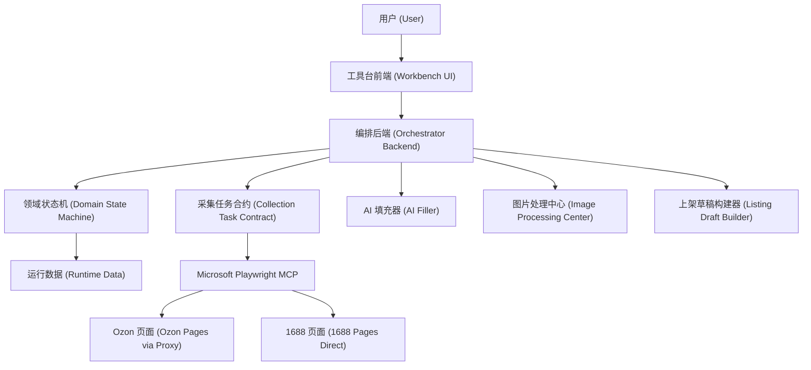

# Ozon V2 工具台架构契约 v0.1 (Workbench Architecture Contract v0.1)

日期 (Date): 2026-07-08

状态 (Status): Accepted for architecture, not implemented

## 目标 (Goal)

Ozon V2 的生产运行主体必须是工具台 (Workbench)，不是 Codex 智能体本身。

Codex 的角色是开发协作 (Development Assistant): 设计、写代码、审查、测试、记录。正式运行时，由工具台前端 (Workbench UI)、编排后端 (Orchestrator Backend)、领域状态机 (Domain State Machine) 和受限适配器 (Restricted Adapters) 执行固定流程。

这样做的原因很简单: 只要把浏览器、文件系统、代码修改和业务判断全部交给通用智能体，智能体就可能绕路径、补捷径、改代码、跳过证据。工具台要把这些能力拆开，让每一步只能做它被允许做的事。

## 硬边界 (Hard Boundaries)

1. Codex 不做生产运行脑 (Production Brain)。Codex 可以帮助开发工具台，但日常采集、填充、处理图片、上架必须由工具台流程控制。
2. 状态机拥有流程 (State Machine Owns Flow)。任何任务只能从当前状态进入允许的下一个状态。
3. AI 只能填 JSON (AI As JSON Filler)。AI 不能直接控制浏览器、不能修改代码、不能写运行状态、不能发布商品。
4. 浏览器只走 Microsoft Playwright MCP (Browser Through Microsoft Playwright MCP Only)。不使用 Codex 内置浏览器，不使用直接 Node Playwright，不使用旧插件。
5. Ozon 走代理 (Ozon Via Proxy)，1688 直连 (1688 Direct)。这条既写入 MCP 启动配置，也写入每个采集任务合约。
6. 证据先于结论 (Evidence Before Decision)。没有结构化证据，就不能进入下一步。
7. 代码和运行数据分离 (Code And Runtime Data Separation)。业务代码留在项目目录，运行数据留在运行目录。
8. 发布默认上锁 (Publish Locked By Default)。v0.1 只生成草稿和证据，不自动真实上架。

## 总体分层 (System Layers)



### 工具台前端 (Workbench UI)

职责 (Responsibilities):

- 展示批次、状态、证据、失败原因和人工复核项。
- 只显示当前状态允许的按钮。
- 允许用户填凭证、确认候选、确认图片、确认发布。
- 不保存业务决策，不直接改运行数据。

### 编排后端 (Orchestrator Backend)

职责 (Responsibilities):

- 接收工具台命令。
- 调用领域状态机判断是否允许执行。
- 生成采集任务合约。
- 调用受限适配器读写运行数据。
- 调用 AI 填充器和图片处理中心。
- 记录不可跳过的操作日志。

### 领域状态机 (Domain State Machine)

职责 (Responsibilities):

- 定义状态、允许转移、失败状态和人工复核状态。
- 执行去重、种子池、单 SKU、同款判断、运费证据、发布门禁等纯规则。
- 不访问浏览器，不访问文件系统，不访问网络。

### 采集适配器 (Collection Adapter)

职责 (Responsibilities):

- 只接收采集任务合约。
- 只通过 Microsoft Playwright MCP 执行页面动作。
- 只返回结构化证据。
- 不改代码，不改状态，不发布商品。

### AI 填充器 (AI Filler)

职责 (Responsibilities):

- 输入采集证据和字段模板。
- 输出结构化 JSON 草稿。
- 不直接写入最终草稿，必须先通过 schema 校验和门禁。

### 图片处理中心 (Image Processing Center)

职责 (Responsibilities):

- 管理 Ozon 风格参考图和 1688 真实商品图。
- 处理翻译图、背景图、主图、富内容图。
- 输出图片结果和处理证据。
- 不决定商品是否同款，不决定是否发布。

### 上架草稿构建器 (Listing Draft Builder)

职责 (Responsibilities):

- 把采集证据、AI 字段、图片结果合成 Ozon 草稿 payload。
- 校验类目、属性、尺寸、价格、图片、运费和 SKU。
- v0.1 只生成草稿，不真实提交。

## 状态机 (State Machine)

主状态 (Main States):

```text
CREATED
NEEDS_CREDENTIALS
DEDUPING_STORE
STORE_DEDUPED
SEED_SELECTED
OZON_COLLECTING
OZON_COLLECTED
SUPPLIER_SEARCHING
SUPPLIER_COLLECTED
SAME_PRODUCT_REVIEW
AI_FILLING
IMAGE_PROCESSING
DRAFT_BUILDING
DRAFT_READY
PUBLISH_WAITING_CONFIRMATION
PUBLISH_SUBMITTED
DONE
```

异常状态 (Exception States):

```text
NEEDS_SLIDER
NEEDS_MANUAL_REVIEW
FAILED_RETRYABLE
FAILED_BLOCKED
```

规则 (Rules):

- `CREATED` 不能直接进入 `OZON_COLLECTING`。
- `NEEDS_CREDENTIALS` 只能由用户凭证助手解除。
- `DEDUPING_STORE` 必须先写入去重刷新标记，才能进入 `STORE_DEDUPED`。
- `SEED_SELECTED` 必须记录本批抽取种子，后续不得临时换随机产品补数。
- `OZON_COLLECTED` 必须有精准类目、属性、国内店铺证据、单 SKU 证据和图片参考。
- `SUPPLIER_COLLECTED` 必须有 1688 同款证据、单 SKU 证据和真实国内运费证据。
- `SAME_PRODUCT_REVIEW` 不通过时不能进入 AI 填充。
- `DRAFT_READY` 不能自动发布，必须进入 `PUBLISH_WAITING_CONFIRMATION`。

## 主流程 (Main Workflow)

1. 凭证检查 (Credential Check): 没有店铺 ID 和密钥时进入 `NEEDS_CREDENTIALS`，只弹一次凭证助手并进入冷却。
2. 店铺去重 (Existing Store Dedupe): 先读取用户店铺已有商品，生成不可采集名单。
3. 种子抽取 (Seed Sampling): 从运行期 active seed pool 随机抽取目标数量，已用种子从池中剔除。
4. Ozon 查询生成 (Ozon Query Generation): 中文种子先转成俄语优先搜索词，不能直接拿中文搜 Ozon。
5. Ozon 采集 (Ozon Collection): 采集中国国内同行店铺爆款，单 SKU，精准类目、属性、图片风格参考必须保留。
6. 1688 搜同款 (1688 Exact Match Search): 必须从 1688 首页以图搜款，1688 直连，找完全一样的真实供应商商品。
7. 同款复核 (Same Product Review): 证据不够就人工复核，不允许用相似款替代。
8. AI 填充 (AI Fill): AI 批量填标题、描述、类目属性、尺寸、富文本等 JSON 草稿。
9. 图片处理 (Image Processing): 学 Ozon 图片风格，用 1688 真实商品重新生成或处理图片。
10. 草稿构建 (Draft Build): 生成 Ozon 上架草稿 payload。
11. 发布确认 (Publish Confirmation): v0.1 不自动发布，后续也必须人工确认或明确策略确认。

## BCS 学习结论 (BCS Learning)

BCS 的“通过链接上架 (List By Link)”本质不是魔法，也不是简单挂现有商品卡。

它更像下面这个链路:

```text
源链接 (Source Link)
  -> 页面采集 (Page Collection)
  -> 插件工作台 (Extension Workbench)
  -> AI 批量填字段 (AI Field Fill)
  -> 图片处理中心 (Image Center)
  -> 上架 payload (Listing Payload)
  -> 提交到用户店铺 (Submit To Seller Store)
```

Ozon V2 可以学习这个结构，但不能照搬它的风险点:

- 不把 Cookie 明文写日志。
- 不让 AI 直接提交。
- 不让浏览器 worker 写状态。
- 不为了速度绕过去重、同款证据、运费证据和发布门禁。

## 采集契约 (Collection Contract)

Ozon 采集 (Ozon Collection):

- 类目不限，但必须从种子池开始。
- 必须是中国国内同行店铺。
- 必须采集精准类目、叶子类目、类目 ID 或等价证据。
- 必须采集商品属性字段。
- 只选一个目标 SKU。
- 必须保存这个目标 SKU 相关图片，用于后续图片风格学习。
- 不采完整多 SKU 树。

1688 采集 (1688 Collection):

- 必须从 `https://www.1688.com/` 首页进入以图搜款。
- 不能从搜索页、详情页、直接 air 链接或中间页开始。
- 1688 必须直连，不走代理。
- 必须找到完全一样的商品。
- 只采一个匹配供应商 SKU。
- 真实供应商 SKU 数量少于 Ozon 无所谓，以真实供应商为准。
- 必须采真实国内运费。具体一件起批且配送行显示包邮时，运费可归一为 `0`，但要保留原始证据。

## 权限隔离 (Permission Isolation)

| 组件 (Component) | 允许 (Allowed) | 禁止 (Forbidden) |
| --- | --- | --- |
| Codex 开发助手 (Codex Development Assistant) | 改代码、写测试、写文档、记录日志 | 作为生产运行入口、绕过工具台直接执行批量业务 |
| 工具台前端 (Workbench UI) | 展示状态、发命令、收用户确认 | 直接写状态、直接采集、直接发布 |
| 编排后端 (Orchestrator Backend) | 调状态机、写运行数据、生成任务 | 跳过状态机、调用旧插件、绕过证据 |
| Playwright MCP worker | 按任务采集页面证据 | 修改代码、写业务状态、发布商品 |
| AI 填充器 (AI Filler) | 输出 JSON 草稿 | 控制浏览器、保存凭证、发布商品 |
| 图片中心 (Image Center) | 处理图片、输出图片证据 | 决定同款、改价格、发布商品 |

## 数据模型 (Data Models)

第一版工具台只需要这些核心对象:

```text
Batch
WorkItem
SeedProduct
ExistingStoreProduct
OzonEvidence
OzonSelectedSkuMedia
SupplierEvidence
SameProductDecision
AiDraft
ImageSet
ListingDraft
RunEvent
ManualReviewItem
```

每个对象必须带 `run_id`、`work_item_id`、`source_captured_at` 和证据来源字段，方便追溯。

## 运行数据 (Runtime Data)

建议运行数据继续保持在运行目录，不进入业务代码:

```text
OzonOpsV2/
  config/
  state/
  runs/
    {run_id}/
      batch.json
      work_items.jsonl
      events.jsonl
      ozon_evidence/
      supplier_evidence/
      ai_drafts/
      images/
      listing_drafts/
      evidence.csv
```

规则 (Rules):

- 运行数据可以删、归档、迁移，但不能放业务代码。
- 源码目录不能保存真实凭证、Cookie、用户店铺密钥。
- Obsidian 日志只能写操作记录和结论，不能写敏感凭证。

## Superpowers 用法 (Superpowers Usage)

Superpowers 对 Ozon V2 有用，但只用于开发过程约束:

- 架构先行 (Design Before Implementation)
- 写计划 (Writing Plans)
- 测试驱动 (Test-Driven Development)
- 代码审查 (Code Review)
- 验证门禁 (Verification Gate)

它不能作为生产运行权限锁。真正防止绕路的，是工具台、状态机、权限隔离和强制证据。

## v0.1 非目标 (Non-Goals)

- 不做真实发布。
- 不做完整 UI。
- 不做多 SKU 全量结构。
- 不迁移旧插件。
- 不接入 Yandex。
- 不使用 Codex 内置浏览器采集。
- 不使用直接 Node Playwright 采集。
- 不把 Cookie 方案定为唯一发布方案。

## 下一步 (Next Step)

下一步只做走通骨架 (Walking Skeleton):

```text
工具台前端空壳 (Workbench UI Shell)
编排后端命令入口 (Orchestrator Command API)
领域状态机测试 (State Machine Tests)
运行事件日志 (Run Event Log)
禁用真实发布 (Publish Disabled)
禁用真实采集 (Collection Mocked)
```

验收标准 (Acceptance):

- 用户只能点当前状态允许的动作。
- 后端拒绝非法状态跳转。
- AI 只能返回 JSON，不能改状态。
- Playwright MCP 只作为采集 worker，不进入业务代码。
- 没有旧插件、Yandex、内置浏览器、直接 Playwright 依赖。
